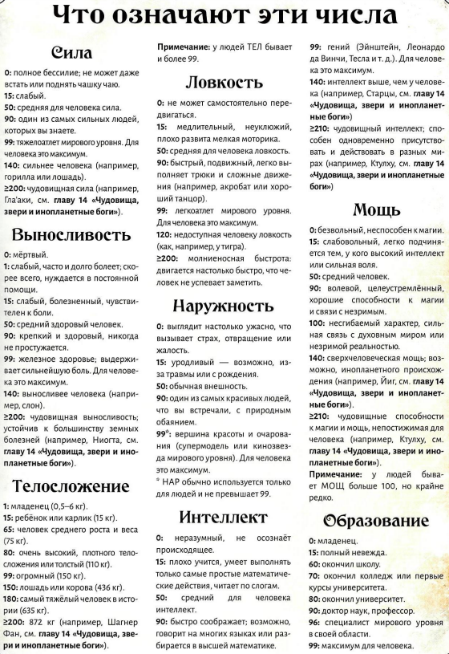

# Определение характеристик

В чарнике сверху находится блок для характеристик. Характеристики это 8 цифр, которые представляют 
собой основу персонажа и говорят о том, как он будет действовать и вести себя во время расследования.

Каждая характеристика определяется рандомно по формуле и может находиться в диапазоне от 15 до 90%.

### Формулы вида xdy
Для игры нужен определенный набор игральных костей: d4, d6, d8, d20, d100 (2 d10 один с единицами, другой с десятками).
По хорошему вам бы иметь у себя по комплекту, но в Roll20 (где мы будем играть) есть норм механизм для кидания кубов по формулам.

Если игра говорит кинуть d6, значит нужно кинуть d6 1 раз и получить результат. Если говорит 3d4, значит нужно кинуть d4
3 раза и сложить результаты бросков. Если говорит 2d8 * 4, значит нужно кинуть d8 2 раза, сложить результаты и умножить 
получившийся результат на 2. Вроде примеры понятные.

## Сила (СИЛ): бросить 3d6 и умножить на 5
Измеряет физическую мощь сыщика. Чем она больше, тем больший вес можно носить или дольше висеть на руках и т.д.

От нее зависит наносимый урон в ближнем бою.

Сила = 0, говорит о том, что сыщик инвалид, который не может встать с постели.

## Выносливость (ВЫН): бросить 3d6 и умножить на 5
Отвечает за здоровье, энергию и жизненную силу. Яды и болезни бьют по выносливости.

Серьезные травмы и магические атаки могут понизить выносливость.

Выносливость = 0, означает смерть.

## Телосложение (ТЕЛ): бросить 2d6 прибавить 6 и умножить все на 5
Отвечает за рост и вес персонажа. Если нужно до куда-то дотянуться или куда-то пролезть, то используется эта характеристика

От телосложения зависят пункты здоровья, бонус к урону и Комплекция.

При потере конечности, телосложение может уменьшиться.

Телосложение = 0, означает что нет человека, исчез неведомо куда.

## Ловкость (ЛВК): бросить 3d6 и умножить на 5
Чем больше ловкость, тем больше скорость, подвижность и физическая гибкость. Если нужно успеть что-то сделать или
кого-то обогнать, то будет проверка ловкости.

В бою персонаж с самой высокой ловкостью ходит первым.

Ловкость = 0, говорит о том, что персонаж теряет координацию и не может выполнять какие-либо физические действия.

## Наружность (НАР): бросить 3d6 и умножить на 5
Физическая привлекательность и личное обаяние. Высокая наружность говорит о том что с человеком приятно общаться и взаимодействовать.

Наружность = 0, говорит о том, что персонаж максимально уродлив, неприятен и отвратителен в общении.

## Интеллект (ИНТ): бросить 2d6 прибавить 6 и умножить все на 5
Показывает как хорошо сыщик обучается, запоминает, анализирует и решает сложные задачи.

От интеллекта зависит кол-во пунктов которые можно потратить на личные навыки, ИНТ * 2 (об этом позже).

Интеллект = 0, превращает вас в идиота "без мозгов" с пеной у рта.

## Мощь (МОЩ): бросить 3d6 и умножить на 5
Мощь - это сила воли. Чем больше мощи, тем выше предрасположенность к магии и устойчивость к ней.

Потеря мощи, как правило, не восстанавливается.

### Рассудок = мощь, на начало игры.
### Пункты магии = мощь разделить на 5

Мощь = 0, лишает человека цели и воли к жизни, а также говорит о неспособности использовать магию.

## Образование (ОБР): бросить 2d6 прибавить 6 и умножить все на 5
Сюда можно отнести как формальное образование, так и накопленный опыт или практические знания, необязательно полученные
в учебном заведении. Отвечает за объем знаний,
а не за умение ими пользоваться.

### Возраст влияет на образование

Образование = 0, говорит о том, что сыщик подобен новорожденному младенцу или потерял память.

## Удача: бросить 3d6 и умножить на 5

# Возраст
Можно выбрать любой возраст в промежутке от 15 до 90 лет (если хочется вне диапазона, то можно обсудить).

После определения возраста нужно провести проверку на улучшение ОБР, для этого нужно кинуть процентные кости (d100 (2d10)).
Если выпало значение больше вашего ОБР, то нужно кинуть d10 и прибавить значение к вашему ОБР.
Пример: ОБР = 60, кинули кубы, выпало 79, значит ОБР можно увеличить, кинули d10, выпало 4, теперь ОБР равен 64. Если ОБР = 60,
а на процентных кубах выпало, допустим, 32, то ОБР не изменится.

- 15-19 лет - Вычесть 5 из ОБР и вычесть суммарно 5 из СИЛ и/или ТЕЛ. При определении удачи кинуть кубы 2 раза и выбрать лучший вариант
- 20-39 лет - Проверка на ОБР (описал выше)
- 40-49 лет - 2 проверки на ОБР, уменьшить НАР на 5, вычесть суммарно 5 из СИЛ, ВЫН и/или ЛВК.
- 50-59 лет - 3 проверки на ОБР, уменьшить НАР на 10, вычесть суммарно 10 из СИЛ, ВЫН и/или ЛВК.
- 60-69 лет - 4 проверки на ОБР, уменьшить НАР на 15, вычесть суммарно 20 из СИЛ, ВЫН и/или ЛВК.
- 70-79 лет - 4 проверки на ОБР, уменьшить НАР на 20, вычесть суммарно 40 из СИЛ, ВЫН и/или ЛВК.
- 80-89 лет - 4 проверки на ОБР, уменьшить НАР на 25, вычесть суммарно 80 из СИЛ, ВЫН и/или ЛВК.

ОБР не может быть больше 99!

# Атрибуты

## Половинные и пятые характеристики
Рядом с каждым числовым значением в чарнике, есть 2 окошка в которые нужно вписать половинные и пятые атрибуты.
Они отвечают за трудные и чрезвычайно трудные проверки соответственно.

К примеру, ВЫН = 60 в половинную пишем 30, в пятую пишем 12. В pdf чарнике атрибуты сами выставятся.

## Вторичные атрибуты

### Бонус к урону и комплекция
У всех сыщиков, персонажей и чудовищ есть такие атрибуты как бонус к урону (БкУ) и Комплекция. Крупные и сильные бьют
больнее чем мелкие и слабые. БкУ применяется при атаках в ближнем бою (не при стрельбе), комплекция при боевых маневрах и погоне.

Для вычисления БкУ и Комплекции нужно сложить СИЛ + ТЕЛ и посмотреть результат по таблице:

| CИЛ + ТЕЛ | БкУ  | Комплекция |
|-----------|------|------------|
| 2-64      | -2   | -2         |
| 65-84     | -1   | -1         |
| 85-124    | нет  | 0          |
| 125-164   | +1d4 | 1          |
| 165-204   | +1d6 | 2          |

### Пункты здоровья
Просто ХП. Максимально кол-во ПЗ насчитывается по формуле (ВЫН + ТЕЛ) разделить на 10.

### Скорость (СКО)
За один раунд сыщик может переместиться на расстояние в метрах равное СКО умножить на 5.

Если ЛВК и СИЛ по отдельности меньше ТЕЛ, СКО = 7
Если ЛВК либо СИЛ равна или выше ТЕЛ, СКО = 8
Если ЛВК и СИЛ выше ТЕЛ, СКО = 9

- 40-49 лет - вычесть 1 из СКО
- 50-59 лет - вычесть 2 из СКО
- 60-69 лет - вычесть 3 из СКО
- 70-79 лет - вычесть 4 из СКО
- 80-89 лет - вычесть 5 из СКО

