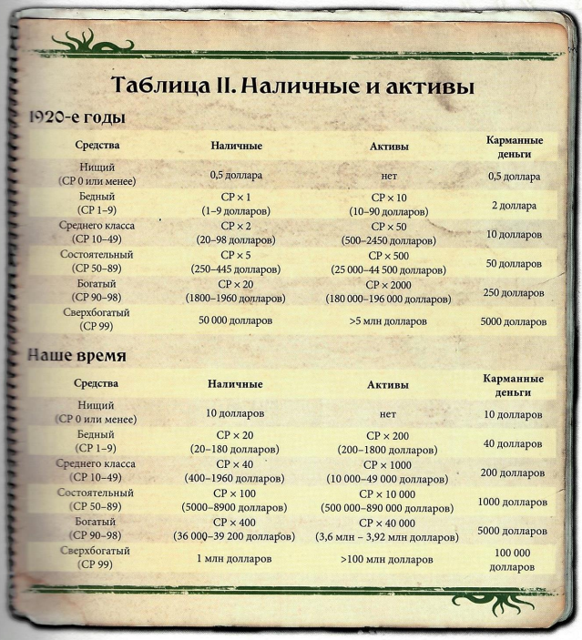

## Профессиональные навыки
Посчитав сколько пунктов навыков у вас есть распределям все между вашими профессиональными
скилами, и (обязательно!) накидываем пункты в Навык "Средства" так, чтобы входить в 
диапазон средств который мы записали в предыдущем шаге. Прибавляем стартовые значения к тем, которые
вы потратили на навык и записываем в квадратик. Вторичные и пятые доли пока не записываем.
## Личные навыки
Теперь берем ваш ИНТ умножаем на 2 и распределяем эти очки на любые навыки (можно записать те которых
нет в списке) кроме "Мифы Ктулху". Как все распределили и сложили, расписываем пятые и вторичные доли.

## Средства
Табличка для понимания достатка.

Тут рассчитываем наличиные, активы и карманные деньги.
