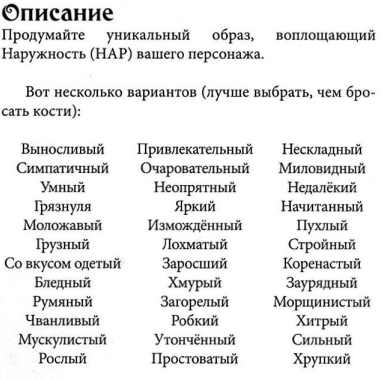
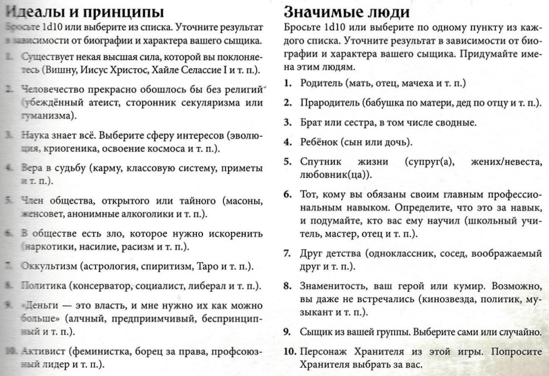
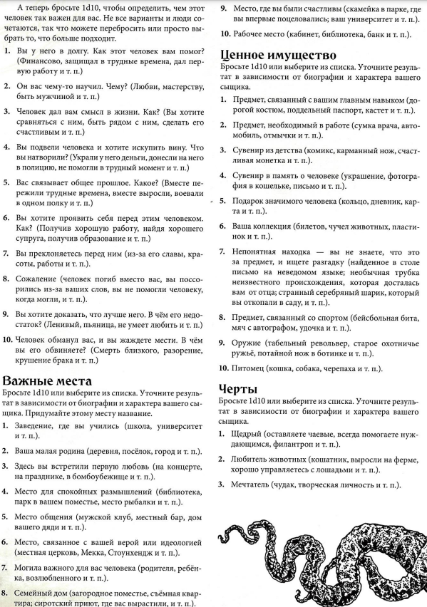
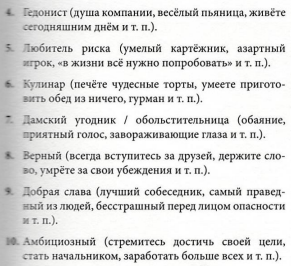

## Биография

На обратной стороне Чарника в разделе биография 10 пунктов. Накидайте в первые 6 лора своего персонажа. Хотя бы по
предложению. Графы Травмы и Шрамы, Фобии и Мании, Маг. Книги и Встречи со сверхъестественным не трогаем (если только
вашему персу это не необходимо). Биография по игре может влиять на восстановление рассудка (на его понижение иногда
тоже). Желательно имена и места с близкими вещами расписать поподробнее.

Если с фантазией туго, можете вдохновиться списочком ниже. Если и выбирать не охота, можно кубами прокинуть.

## Ключевая связь
После того как накидаете биографию, нужно выбрать 1 пункт который для персонажа будет наиболее важным. Это будет
ключевая связь - то, что больше всего влияет не его жизнь. Можно звездочкой пометить этот пункт. На эту связь ваш
персонаж будет рассчитывать в трудные для себя моменты и нужна будет для восстановления рассудка.

## Дополнительные детали
С именем, полом и портретом (нарисуйте, вклейте, проигнорьте) все вроде понятно. По месту рождения, большая часть
историй Лавкрафта происходит в Новой Англии на северо-востоке США. Но никто не запрещает вам жить и рождаться где
угодно в мире. Только обоснуйте, как и зачем вы приехали в аркхэм (если сюжет там происходит).